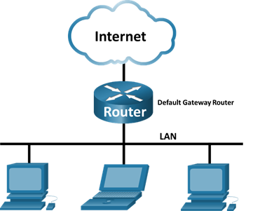
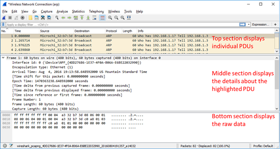
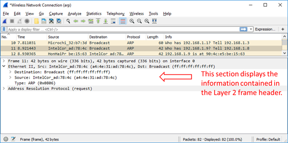
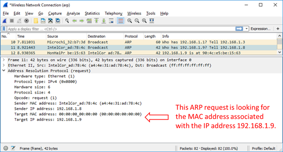

# D03-01: Преглед на прихванат мрежов трафик във Wireshark

## Топология



## Цели на упражнението

### Част 1: Прихващане и анализ на локални ARP данни във Wireshark

- Стартиране и спиране прихващането на данни от ping трафик до отдалечени хостове
- Намиране на IPv4 и MAC адресна информация в прихванатите PDU пакети
- Анализиране на съдържанието на ARP съобщенията, обменени между устройствата в LAN

### Част 2: Преглед на ARP кеш записите на компютъра

- Достъп до Windows Command Prompt
- Използване на командата `arp` за преглед на локалната ARP таблица в кеша на компютъра

## Теоретична основа / Сценарий

**Address Resolution Protocol (ARP)** се използва от TCP/IP за напасване  за напасване на IPv4 адрес от слой 3 към MAC адрес от слой 2. Когато Ethernet frame се изпраща в мрежата, toj трябва да има destination MAC адрес. За да открие динамично MAC адреса на известна дестинация, source устройството излъчва (broadcast) ARP request в локалната мрежа. Устройството, което притежава IP адреса, отговаря с ARP reply съобщение, което съдържа неговия MAC адрес.

Всяко устройство в локалната мрежа поддържа собствен ARP кеш. ARP кешът е малка област в RAM паметта, която съхранява ARP отговорите. Преглеждането на ARP кеша на компютър показва IPv4 адреса и MAC адреса на всяко устройство в локалната мрежа, с което компютърът е обменил ARP съобщения

**Wireshark** е софтуерен protocol analyzer (пакетен анализатор), или \"packet sniffer\" приложение, използвано за capture и преглед на данни, пътуващи взад и напред през мрежата. Wireshark декодира пакета до нивото на полетата (fields) в рамката. Wireshark използва port mirroring за да може един хост да \"слуша\" трафика на цяла мрежа.

Когато данните се изпращат от един хост към друг в мрежата, пакетът е капсулиран с информация за заглавката (header), която включва source и destination MAC адреси. MAC адресът на destination хоста се открива чрез ARP процеса. ARP съобщенията се обменят между различните устройства, за да се картографират известни IP адреси към MAC адреси. Чрез изследване на ARP съобщенията в Wireshark, можете да наблюдавате този процес и да идентифицирате IP и MAC адреси на хостове, комуникиращи в локалната мрежа.

## Необходими ресурси

- 1 PC (Windows 10)
- Достъп до Интернет
- Допълнителни компютри в локалната мрежа (LAN), които ще отговарят на ping заявки. Ако няма допълнителни компютри в LAN, ще се използва default gateway адресът за отговор на ping заявките.

---

## Част 1: Прихващане и анализ на локални ARP данни във Wireshark

В Част 1 на това упражнение, ще направите ping на друг компютър в LAN и ще прихванете ARP requests и replies във Wireshark. Ще разгледате и вътре в прихванатите рамки за специфична информация. Този анализ трябва да помогне за изяснение как пакетните headers се използват за транспорт на данни до тяхната дестинация.

### Стъпка 1: Извличане на интерфейсните адреси на вашия компютър

За това упражнение ще трябва да извлечете IPv4 адреса и MAC адреса на вашия компютър.

**a.** Отворете Command Prompt прозорец и въведете командата `ipconfig /all`.

**b.** Отбележете кой мрежов адаптер използва компютърът за достъп до мрежата. Запишете IPv4 адреса и MAC адреса (Physical Address) на интерфейса на вашия компютър.

```
C:\Users\Student>ipconfig /all

<output omitted>

Wireless LAN adapter Wireless Network Connection:
   Connection-specific DNS Suffix  . :
   Description . . . . . . . . . . . : Intel(R) Centrino(R) Advanced-N 6205
   Physical Address. . . . . . . . . : A4-AE-31-AD-78-4C
   DHCP Enabled. . . . . . . . . . . : Yes
   Autoconfiguration Enabled . . . . : Yes
   Link-local IPv6 Address . . . . . : fe80::f9e7:e41d:a772:f993%11(Preferred)
   IPv4 Address. . . . . . . . . . . : 192.168.1.8(Preferred)
   Subnet Mask . . . . . . . . . . . : 255.255.255.0
   Lease Obtained. . . . . . . . . . : Thursday, August 04, 2016 05:35:35 PM
   Lease Expires . . . . . . . . . . : Friday, August 05, 2016 05:35:35 PM
   Default Gateway . . . . . . . . . : 192.168.1.1
   DHCP Server . . . . . . . . . . . : 192.168.1.1
   DHCPv6 IAID . . . . . . . . . . . : 245648945
   DHCPv6 Client DUID. . . . . . . . : 00-01-00-01-1B-87-BF-52-A4-4E-31-AD-78-4C
   DNS Servers . . . . . . . . . . . : 192.168.1.1
   NetBIOS over Tcpip. . . . . . . . : Disabled
```

**c.** Попитайте колега за IPv4 адреса на техния компютър и дайте вашия IPv4 адрес на тях. Не давайте вашия MAC адрес в този момент.

Запишете IPv4 адресите на default gateway и другите компютри в LAN.

### Стъпка 2: Стартиране на Wireshark и започване прохващането на данни

**a.** На вашия компютър, кликнете **Start** и напишете **Wireshark**. Кликнете **Wireshark Desktop App**, когато се покаже в резултатите от търсенето.

> **Забележка:** Алтернативно, вашата инсталация на Wireshark може да предложи и **Wireshark Legacy** опция. Това показва Wireshark в по-старият, но широко разпознаваем интерфейс. Останалата част от това упражнение е завършена с новия Desktop App GUI.

**b.** След като Wireshark стартира, изберете мрежовия интерфейс, който идентифицирахте с командата `ipconfig`. Въведете **arp** в filter полето. Това настройва Wireshark да показва само пакети, които са част от ARP обмена между устройствата в локалната мрежа. След като сте избрали правилния интерфейс и въвели филтър информацията, кликнете **Start capturing packets** (shark fin icon), за да започнете прихващането на данни.

Информацията ще започне да се придвижва надолу в горната секция на Wireshark. Всеки ред представлява съобщение, изпратено между source и destination устройство в мрежата.

**c.** В Command Prompt прозорец, направете ping на default gateway, за да тествате свързаността към адреса на gateway, който беше идентифициран в Част 1, Стъпка 1.

```
C:\Users\Student>ping 192.168.1.1

Pinging 192.168.1.1 with 32 bytes of data:
Reply from 192.168.1.1: bytes=32 time=7ms TTL=64
Reply from 192.168.1.1: bytes=32 time=2ms TTL=64
Reply from 192.168.1.1: bytes=32 time=1ms TTL=64
Reply from 192.168.1.1: bytes=32 time=6ms TTL=64

Ping statistics for 192.168.1.1:
    Packets: Sent = 4, Received = 4, Lost = 0 (0% loss),
Approximate round trip times in milli-seconds:
    Minimum = 1ms, Maximum = 7ms, Average = 4ms
```

**d.** Направете ping на IPv4 адресите на други компютри в LAN, които са ви дали вашите колеги.

> **Забележка:** Ако компютърът на вашия колега не отговаря на ping, това може да се дължи на firewall, който блокира тези заявки. Помолете преподавателя за помощ за деактивиране на firewall при необходимост.

**e.** Спрете прохващането на данни, като кликнете **Stop Capture** (червен квадрат icon) на toolbar.

### Стъпка 3: Изследване на прихванатите данни

В Стъпка 3 ще изследвате данните, които са генерирани от ping заявките към компютъра на вашия колега. Wireshark данните се показват в три секции:

1. **Горната секция** показва списъка на прихванатите PDU frames с резюме на IPv4 пакетната информация.
2. **Средната секция** показва PDU информацията за избраната рамка в горната част на екрана и разделя прихванатата PDU рамка по нейните protocol layers.
3. **Долната секция** показва суровите данни (raw data) на всеки layer. Суровите данни се показват в hexadecimal и decimal формат.

**a.** Кликнете на една от ARP рамките в горната секция, която има MAC адреса на вашия компютър като source адрес в рамката и "broadcast" като destination на рамката.

**b.** С тази PDU рамка все още избрана в горната секция, навигирайте към средната секция. Кликнете на стрелката вляво от реда **Ethernet II**, за да видите Destination и Source MAC адресите.

_Съвпада ли Source MAC адресът с интерфейса на вашия компютър?_



**c.** Кликнете на стрелката вляво от реда **Address Resolution Protocol (request)**, за да видите съдържанието на ARP request.

### Стъпка 4: Намиране на ARP response рамката, която съответства на ARP request, който сте маркирали

**a.** Използвайки **Target IPv4 address** в ARP request, намерете ARP response рамката в горната секция на Wireshark capture екрана.

_Какъв е IPv4 адресът на Target устройството във вашия ARP request?_

**b.** Маркирайте response рамката в горната секция на Wireshark output. Може да се наложи да превъртите прозореца, за да намерите response рамката, която съответства на Target IPv4 адреса, идентифициран в предишната стъпка. Разгънете **Ethernet II** и **Address Resolution Protocol (response)** редовете в средната секция на екрана.

_Е ли ARP response рамката broadcast рамка?_

_Какъв е destination MAC адресът на рамката?_

_Съвпада ли това с MAC адреса на вашия компютър?_

_Какъв MAC адрес е source на рамката?_



**c.** Проверете с вашия колега дали MAC адресът съвпада с MAC адреса на техния компютър.

---

## Част 2: Изследване на ARP кеш записите на компютъра

Когато устройствата изпращат трафик в локалната мрежа, те трябва да картографират IP адресите към MAC адреси. За да минимизират броя на ARP broadcasts, компютрите кешират ARP отговорите в паметта за кратък период от време.

### Стъпка 1: Преглед на ARP кеша на вашия компютър

**a.** От Command Prompt прозорец, въведете `arp -a` и натиснете Enter.

```
C:\Users\Student>arp -a

Interface: 192.168.1.8 --- 0xb
  Internet Address      Physical Address      Type
  192.168.1.1           c0-3f-0e-b7-ce-30     dynamic
  192.168.1.11          08-3e-8e-ba-e4-f9     dynamic
  192.168.1.255         ff-ff-ff-ff-ff-ff     static
  224.0.0.22            01-00-5e-00-00-16     static
  224.0.0.251           01-00-5e-00-00-fb     static
  224.0.0.252           01-00-5e-00-00-fc     static
  239.255.255.250       01-00-5e-7f-ff-fa     static
  255.255.255.255       ff-ff-ff-ff-ff-ff     static
```

_Появяват ли се всички устройства, които направихте ping, в ARP таблицата? Ако не, защо?_



### Стъпка 2: Изследване на ARP process, когато кеш записът изчезне

**a.** Оставете Wireshark отворен със същия филтър. В Command Prompt, въведете `arp -d` и натиснете Enter. Това изтрива всички записи в ARP кеша.

```
C:\Users\Student>arp -d
```

**b.** Във Wireshark, кликнете **Start capturing packets** (shark fin icon), за да започнете ново прихващане.

**c.** От Command Prompt, направете ping на default gateway или на друг компютър в мрежата.

**d.** Спрете прихващането във Wireshark. Ще видите нови ARP request и reply съобщения в Wireshark capture.

**e.** Въведете `arp -a` в Command Prompt отново. Сега ще видите запис за устройството, което току-що направихте ping.

---

## Въпроси за размисъл

**1.** Каква е ползата от запазването на ARP кеш записите в паметта на source компютъра?

_Запазването на ARP кеш записи намалява броя на ARP broadcast съобщения в мрежата. Когато хост трябва да изпрати данни към друг хост, той първо проверява своя ARP кеш за съответстващ MAC адрес, преди да изпраща ARP request. Това ускорява комуникацията и намалява мрежовия трафик._

**2.** Ако destination IPv4 адресът не е в същата мрежа като source host, какъв MAC адрес ще се използва като destination target MAC адрес в рамката?

_Ако destination IPv4 адресът е в различна мрежа, source host ще използва MAC адреса на default gateway (router) като destination MAC адрес в Ethernet рамката. Router устройството ще се погрижи за препращането на пакета към правилната мрежа._

---


<script data-goatcounter="https://satanasov.goatcounter.com/count"
        async src="//gc.zgo.at/count.js"></script>

<script src="/SNA/assets/js/analytics-logger.js"></script>

## Заключение

В това упражнение научихме как да използваме Wireshark за заснемане и анализ на ARP трафик в локалната мрежа. Разбрахме как ARP протоколът работи за картографиране на IP адреси към MAC адреси, и как компютрите кешират тази информация за по-ефективна комуникация. Wireshark е мощен инструмент за дълбок анализ на мрежови протоколи и разбиране на техните механизми.
