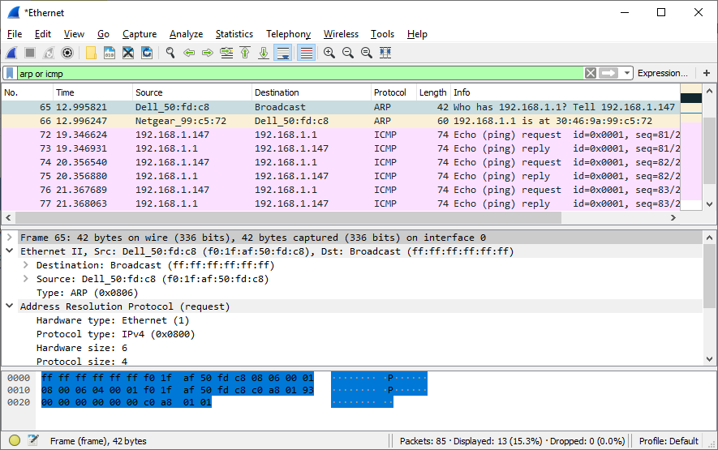
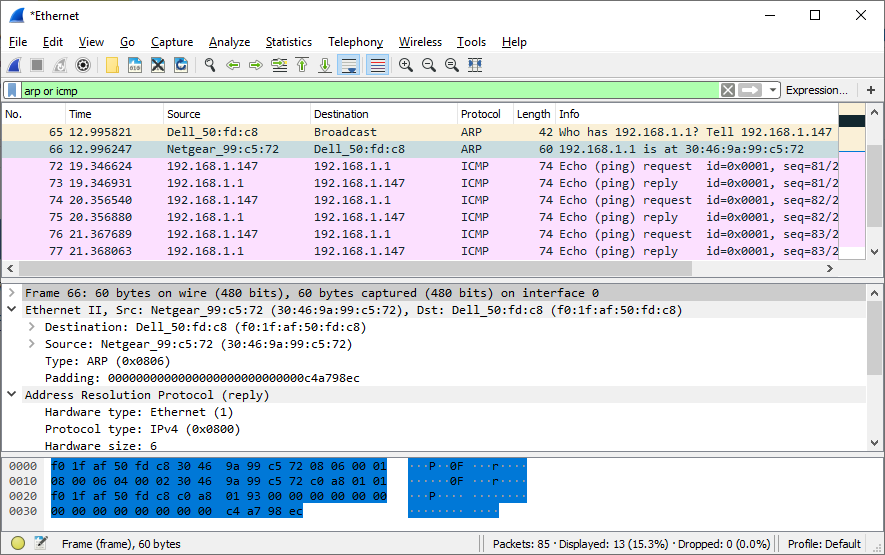
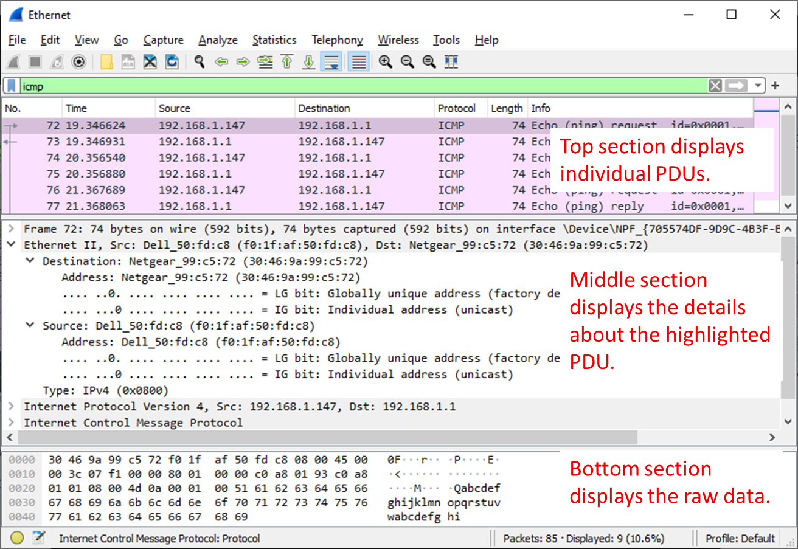

# D03-02: Използване на Wireshark за изследване на Ethernet рамки (frames)

## Цели на упражнението

### Част 1: Изследване на заглавните полета в Ethernet II рамка

- Преглед на описанията и дължините на полетата в Ethernet II header
- Изследване на мрежовата конфигурация на компютъра
- Изследване на Ethernet рамки в Wireshark capture
- Изследване на съдържанието на Ethernet II header в ARP request

### Част 2: Използване на Wireshark за заснемане и анализ на Ethernet рамки

- Определяне на IP адреса на default gateway
- Стартиране на заснемане на трафик на NIC
- Филтриране на Wireshark за показване само на ICMP трафик
- Ping към default gateway
- Спиране на заснемането
- Изследване на Echo (ping) request рамки
- Заснемане на пакети за отдалечен хост

## Теоретична основа / Сценарий

Когато горни layer протоколи комуникират помежду си, данните текат надолу през OSI или TCP/IP model layers и са капсулирани в Layer 2 рамка, когато достигнат data link layer. Структурата на рамката е свързана с типа на медията, през която данните се предават. Например, data frames, които пътуват през Ethernet медия, се различават от data frames, които пътуват през WLAN или serial медия.

**Ethernet II рамката** е типична структура, използвана в TCP/IP мрежи. Когато Wireshark заснема рамки, всички полета на рамката са декодирани и показвани. Тези рамки могат да бъдат изследвани подробно за разбиране на типа на трафика, който пътува в мрежата.

В това упражнение ще разгледате заглавните полета и съдържанието в Ethernet II рамка. Ще използвате Wireshark за заснемане и изследване на Ethernet II рамки за локални и отдалечени хостове.

## Необходими ресурси

- 1 PC (Windows 10 с достъп до Интернет)
- Wireshark инсталиран на компютъра

---

## Част 1: Изследване на заглавните полета в Ethernet II рамка

В Част 1 ще изследвате заглавните полета и съдържанието в Ethernet II рамка. Wireshark capture ще се използва за изследване на съдържанието в тези полета.

### Стъпка 1: Преглед на описанията и дължините на полетата в Ethernet II header

Ethernet II рамката се състои от следните полета:

| **Поле** | **Дължина** | **Описание** |
|----------|-------------|--------------|
| **Preamble** | 7 байта | Използва се за синхронизация между изпращащо и получаващо устройство |
| **Start Frame Delimiter (SFD)** | 1 байт | Сигнализира началото на рамката |
| **Destination MAC Address** | 6 байта | MAC адресът на устройството-получател |
| **Source MAC Address** | 6 байта | MAC адресът на устройството-изпращач |
| **Type / Length** | 2 байта | Идентифицира upper-layer протокола (обикновено IPv4 или IPv6) |
| **Data** | 46-1500 байта | Съдържа payload данните (Layer 3 PDU) |
| **Frame Check Sequence (FCS)** | 4 байта | Използва се за откриване на грешки в рамката |

> **Забележка:** Preamble и SFD полетата не се показват от Wireshark, тъй като тези полета се обработват на hardware ниво от мрежовия адаптер.

### Стъпка 2: Изследване на мрежовата конфигурация на компютъра

В този пример, компютърът има IP адрес **192.168.1.147** и default gateway с IP адрес **192.168.1.1**. (За Linux и MAC OS, използвайте командата `ifconfig` в терминала.)

```
C:\>ipconfig /all

Ethernet adapter Ethernet:

   Connection-specific DNS Suffix  . :
   Description . . . . . . . . . . . : Intel(R) 82579LM Gigabit Network Connection
   Physical Address. . . . . . . . . : F0-1F-AF-50-FD-C8
   DHCP Enabled. . . . . . . . . . . : Yes
   Autoconfiguration Enabled . . . . : Yes
   Link-local IPv6 Address . . . . . : fe80::58c5:45f2:7e5e:29c2%11(Preferred)
   IPv4 Address. . . . . . . . . . . : 192.168.1.147(Preferred)
   Subnet Mask . . . . . . . . . . . : 255.255.255.0
   Lease Obtained. . . . . . . . . . : Friday, September 6, 2019 11:08:36 AM
   Lease Expires . . . . . . . . . . : Saturday, September 7, 2019 11:08:36 AM
   Default Gateway . . . . . . . . . : 192.168.1.1
   DHCP Server . . . . . . . . . . . : 192.168.1.1
   <output omitted>
```

### Стъпка 3: Изследване на Ethernet рамки в Wireshark capture

Следващите screenshots на Wireshark capture показват пакетите, генерирани от ping, издаден от PC host към неговия default gateway. Филтър (**arp or icmp**) е приложен към Wireshark за преглед само на ARP и ICMP протоколите. ARP означава Address Resolution Protocol и се използва за определяне на MAC адреса, свързан с IP адреса. Сесията започва с ARP query и reply за MAC адреса на gateway router, последвани от четири ping requests и replies.



Този screenshot подчертава детайлите на рамката за ARP request.



Този screenshot подчертава детайлите на рамката за ARP reply.

### Стъпка 4: Изследване на съдържанието на Ethernet II header в ARP request

Следващата таблица взема първата рамка в Wireshark capture и показва данните в полетата на Ethernet II header:

| **Поле** | **Стойност** |
|----------|--------------|
| **Destination MAC Address** | ff:ff:ff:ff:ff:ff (broadcast) |
| **Source MAC Address** | f0:1f:af:50:fd:c8 |
| **Type** | 0x0806 (ARP) |

#### Въпроси:

**1.** Какво е значимо в съдържанието на destination address полето?

_Destination адресът е **ff:ff:ff:ff:ff:ff**, което е broadcast MAC адрес. Това означава, че ARP request се изпраща към всички устройства в локалната мрежа._

**2.** Защо компютърът изпраща broadcast ARP преди да изпрати първия ping request?

_Компютърът трябва да научи MAC адреса на default gateway, за да може да изпрати ping пакета. Тъй като първоначално не знае MAC адреса, той изпраща broadcast ARP request, за да попита "Кой има IP адрес 192.168.1.1?"._

**3.** Какъв е MAC адресът на source в първата рамка?

_Source MAC адресът е **F0:1F:AF:50:FD:C8**, който е MAC адресът на мрежовия адаптер на компютъра._

**4.** Какъв е Vendor ID (OUI) на Source NIC в ARP request?

_OUI (Organizationally Unique Identifier) е **F0:1F:AF**, което идентифицира производителя на мрежовата карта (в този случай Intel)._

**5.** Коя част от MAC адреса е OUI?

_Първите 3 октета (байта) на MAC адреса представляват OUI._

**6.** Какъв е NIC серийният номер на source?

_Последните 3 октета **50:FD:C8** представляват серийния номер на мрежовата карта, присвоен от производителя._

---

## Част 2: Използване на Wireshark за заснемане и анализ на Ethernet рамки

В Част 2 ще използвате Wireshark за заснемане на локални и отдалечени Ethernet рамки. След това ще изследвате информацията, съдържаща се в заглавните полета на рамката.

### Стъпка 1: Определяне на IP адреса на default gateway на вашия компютър

**a.** Отворете Windows command prompt.

**b.** Отворете command prompt прозорец и въведете командата `ipconfig`. (За Linux и MAC OS въведете командата `netstat -rn` в терминала.)

**c.** Запишете IP адреса на default gateway на компютъра.

```
C:\>ipconfig

Ethernet adapter Ethernet:

   Connection-specific DNS Suffix  . :
   Link-local IPv6 Address . . . . . : fe80::58c5:45f2:7e5e:29c2%11
   IPv4 Address. . . . . . . . . . . : 192.168.1.147
   Subnet Mask . . . . . . . . . . . : 255.255.255.0
   Default Gateway . . . . . . . . . : 192.168.1.1
```

_Какъв е IP адресът на default gateway на вашия компютър?_

**d.** Затворете Windows command prompt прозореца.

### Стъпка 2: Стартиране на заснемане на трафик на NIC на компютъра

**a.** Отворете Wireshark за да стартирате заснемането на данни. Кликнете двукратно на желания network device interface с мрежов трафик, за да стартирате capture.

**b.** Наблюдавайте трафика, който се появява в packet list прозореца.

### Стъпка 3: Филтриране на Wireshark за показване само на ICMP трафик

Можете да използвате филтъра в Wireshark за блокиране на видимостта на нежелан трафик. Филтърът не блокира заснемането на нежелани данни; той само филтрира какво искате да се показва на екрана. За сега, само ICMP трафик ще бъде показван.

В **Wireshark Filter** полето, напишете **icmp**. Полето трябва да стане зелено, ако сте въвели филтъра правилно. Ако полето е зелено, кликнете **Apply** (дясна стрелка), за да приложите филтъра.

### Стъпка 4: От command prompt прозореца, направете ping на default gateway на вашия компютър

**a.** Отворете Windows command prompt.

**b.** От command prompt прозореца, направете ping на default gateway, използвайки IP адреса, който записахте в Стъпка 1.

```
C:\>ping 192.168.1.1

Pinging 192.168.1.1 with 32 bytes of data:
Reply from 192.168.1.1: bytes=32 time<1ms TTL=64
Reply from 192.168.1.1: bytes=32 time<1ms TTL=64
Reply from 192.168.1.1: bytes=32 time<1ms TTL=64
Reply from 192.168.1.1: bytes=32 time<1ms TTL=64

Ping statistics for 192.168.1.1:
    Packets: Sent = 4, Received = 4, Lost = 0 (0% loss),
Approximate round trip times in milli-seconds:
    Minimum = 0ms, Maximum = 0ms, Average = 0ms
```

**c.** Затворете Windows command prompt прозореца.

### Стъпка 5: Спиране на заснемането на трафик на NIC

Кликнете на иконата **Stop Capturing Packets** (червен квадрат), за да спрете заснемането на трафик.

### Стъпка 6: Изследване на първия Echo (ping) request във Wireshark

Wireshark главният прозорец е разделен на три секции: **Packet List pane** (горе), **Packet Details pane** (средата) и **Packet Bytes pane** (долу). Ако сте избрали правилния интерфейс за packet capturing преди това, Wireshark трябва да показва ICMP информацията в packet list pane.



**a.** В packet list pane (горната секция), кликнете на първата рамка, изброена в списъка. Трябва да видите **Echo (ping) request** под заглавието **Info**. Редът трябва да бъде подсветен.

**b.** Изследвайте първия ред в packet details pane (средната секция). Този ред показва дължината на рамката.

_Каква е дължината на рамката?_

**c.** Вторият ред в packet details pane показва, че това е Ethernet II рамка. Source и destination MAC адресите също са показани.

_Какъв е MAC адресът на PC NIC?_

_Какъв е MAC адресът на default gateway?_

**d.** Кликнете на знака "по-голямо от" (**>**) в началото на втория ред, за да получите повече информация за Ethernet II рамката.

_Какъв тип рамка се показва?_

**e.** Последните два реда, показани в средната секция, предоставят информация за data полето на рамката. Забележете, че данните съдържат source и destination IPv4 address информация.

_Какъв е source IP адресът?_

_Какъв е destination IP адресът?_

**f.** Можете да кликнете на всеки ред в средната секция, за да подсветите тази част от рамката (hex и ASCII) в **Packet Bytes pane** (долната секция). Кликнете на реда **Internet Control Message Protocol** в средната секция и изследвайте какво е подсветено в **Packet Bytes pane**.

_Какво изписват последните два подсветени октета?_

_(Обикновено това е част от ICMP payload данните, често показващи букви като "abcd" или цифри)_

**g.** Кликнете на следващата рамка в горната секция и изследвайте Echo reply рамката. Забележете, че source и destination MAC адресите са разменени, тъй като тази рамка е изпратена от default gateway router като отговор на първия ping.

_Кое устройство и MAC адрес се показват като destination адрес?_

_(Трябва да бъде вашият компютър и неговият MAC адрес)_

### Стъпка 7: Заснемане на пакети за отдалечен хост

**a.** Кликнете на иконата **Start Capture**, за да стартирате ново Wireshark заснемане. Ще получите popup прозорец, който пита дали искате да запазите предишните заснети пакети във файл преди да стартирате ново заснемане. Кликнете **Continue without Saving**.

**b.** В command prompt прозорец, направете ping на **www.cisco.com**.

```
C:\>ping www.cisco.com

Pinging e144.dscb.akamaiedge.net [23.222.28.109] with 32 bytes of data:
Reply from 23.222.28.109: bytes=32 time=30ms TTL=56
Reply from 23.222.28.109: bytes=32 time=29ms TTL=56
Reply from 23.222.28.109: bytes=32 time=30ms TTL=56
Reply from 23.222.28.109: bytes=32 time=29ms TTL=56

Ping statistics for 23.222.28.109:
    Packets: Sent = 4, Received = 4, Lost = 0 (0% loss),
Approximate round trip times in milli-seconds:
    Minimum = 29ms, Maximum = 30ms, Average = 29ms
```

**c.** Спрете заснемането на пакети.

**d.** Изследвайте новите данни в packet list pane на Wireshark.

_В първата echo (ping) request рамка, какви са source и destination MAC адресите?_

- Source: ________________
- Destination: ________________

_Какви са source и destination IP адресите, съдържащи се в data полето на рамката?_

- Source: ________________
- Destination: ________________

_Сравнете тези адреси с адресите, които получихте в предишната стъпка. Единственият адрес, който се е променил, е destination IP адресът. Защо destination IP адресът се е променил, докато destination MAC адресът е останал същият?_

_Когато ping се изпраща към отдалечен хост (извън локалната мрежа), destination MAC адресът е MAC адресът на default gateway (router), защото пакетът трябва първо да премине през gateway. Destination IP адресът обаче остава адресът на крайната дестинация (www.cisco.com), защото IP адресът не се променя, докато пакетът пътува през мрежи._

---

## Въпроси за размисъл

**Wireshark не показва preamble полето на frame header. Какво съдържа preamble?**

_Preamble полето съдържа 7 байта, използвани за синхронизация между изпращащото и получаващото устройство. Съдържа алтернираща последователност от 1 и 0, която позволява на получаващото устройство да синхронизира своя часовник с часовника на изпращащото устройство. Preamble се обработва на hardware ниво и не се вижда в софтуерни анализатори като Wireshark._

---

## Заключение

В това упражнение научихме структурата на Ethernet II рамка и как да изследваме различните полета в header. Разбрахме ролята на MAC адресите в локалната комуникация и как Ethernet рамките капсулират IP пакети. Също така видяхме разликата между комуникация с локален хост (в същата мрежа) и отдалечен хост (извън локалната мрежа), като наблюдавахме как destination MAC адресът винаги сочи към следващия hop (gateway router за отдалечени хостове), докато destination IP адресът остава адресът на крайната дестинация.
