# Ethernet, капсулиране и комутация
## Лекция: Системно и мрежово администриране

**Преподавател:** гл. ас. Светослав Атанасов  
**Електронна поща:** svetoslav.atanasov@trakia-uni.bg  
**Университет:** Тракийски университет - Стара Загора

---

## Цели на лекцията

По време на тази лекция ще научите:

- Как се осъществява комуникацията в Ethernet мрежите
- Какво представлява процесът на капсулиране
- Структурата на Ethernet frame и неговите полета
- Типовете MAC адреси и тяхната употреба
- Как работят Ethernet комутаторите
- Как се изгражда MAC адресната таблица

---

# Част I: Основи на Ethernet

## 1.1 Възникване и развитие на Ethernet

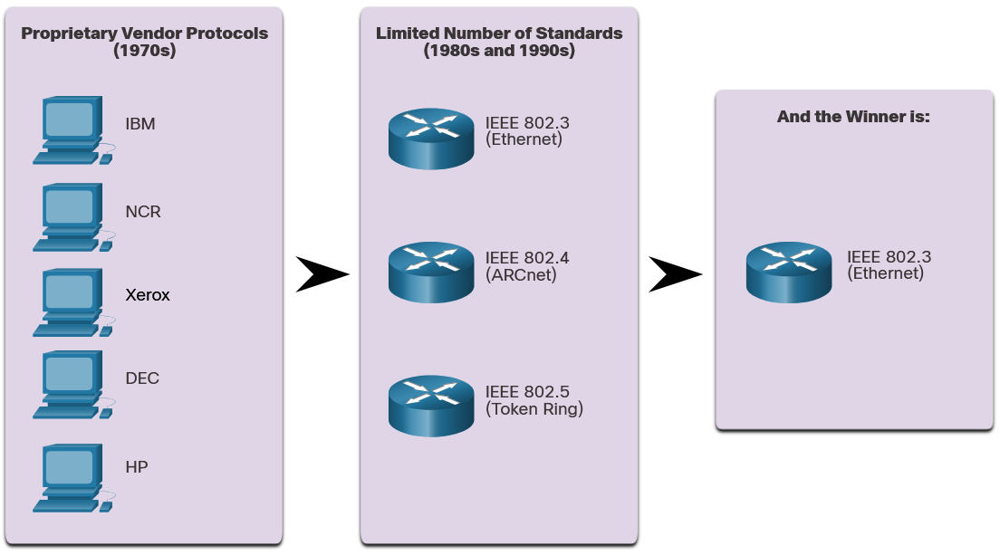

В ранните дни на мрежите всеки производител използваше собствени патентовани методи за свързване на мрежови устройства и протоколи. Ако закупите оборудване от различни производители, нямаше гаранция, че то ще работи заедно.

С разрастването на мрежите бяха разработени **стандарти**, които дефинират правила за работа на мрежово оборудване от различни производители.

### Предимства на стандартите:

- Улесняват проектирането
- Опростяват разработката на продукти
- Насърчават конкуренцията
- Осигуряват последователно свързване
- Улесняват обучението
- Предоставят повече избор на производители за клиентите

**Ethernet** е станал **де факто стандарт** - технологията, използвана от почти всички локални мрежи (LAN).

---

## 1.2 Еволюция на Ethernet стандартите

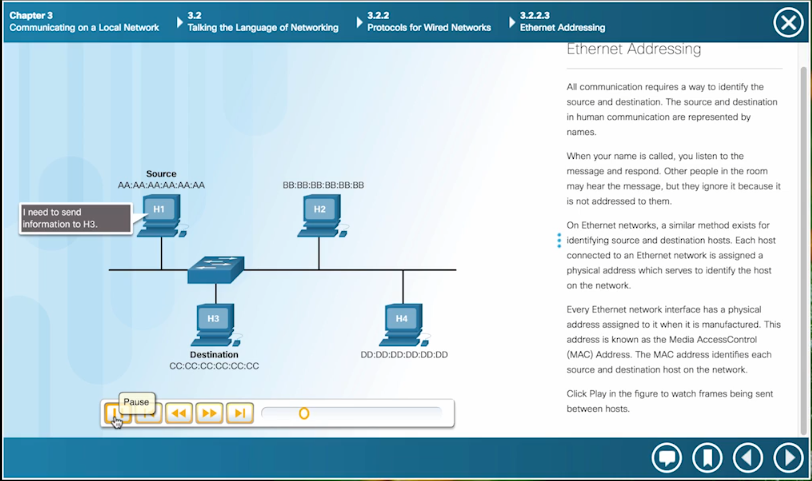

**Institute of Electrical and Electronics Engineers (IEEE)** поддържа мрежовите стандарти, включително Ethernet и безжичните стандарти.

Комитетът, отговорен за Ethernet стандартите, е **IEEE 802.3**.

### Нотация на стандартите

Например: **802.3 100BASE-T**

- **100** = скорост в Mbps
- **BASE** = baseband предаване
- **T** = тип кабел (twisted-pair - усукана двойка)

### Хронология на развитието

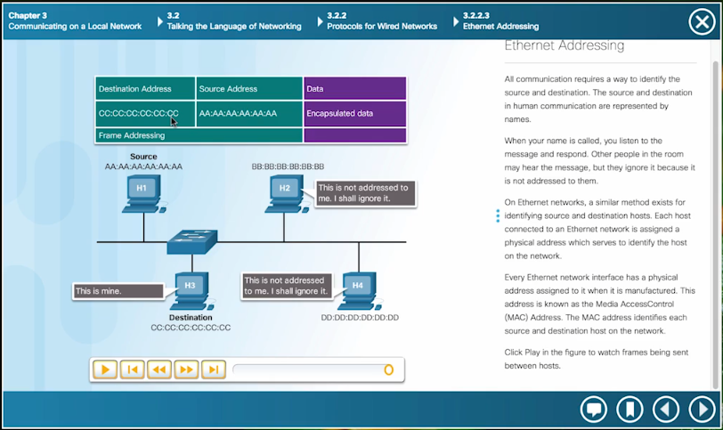

| Година | Стандарт | Скорост | Среда |
|--------|----------|---------|-------|
| 1973 | Оригинален Ethernet | 10 Mbps | Коаксиален кабел |
| 1995 | Fast Ethernet (100BASE-T) | 100 Mbps | Усукана двойка |
| 1998 | Gigabit Ethernet (1000BASE-T) | 1 Gbps | Усукана двойка/Оптика |
| 2002 | 10 Gigabit Ethernet | 10 Gbps | Оптичен кабел |
| 2010 | 40/100 Gigabit Ethernet | 40/100 Gbps | Оптичен кабел |

Способността на Ethernet да се подобрява с времето е една от основните причини за неговата популярност.

---

# Част II: Капсулиране и Data Link слоя

## 2.1 Концепцията за капсулиране

### Аналогия с писмо

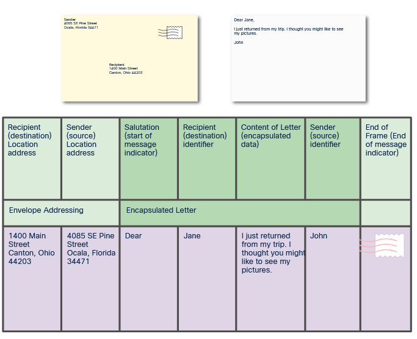

Когато изпращате писмо, използвате приет формат, за да се гарантира, че писмото ще бъде доставено и разбрано от получателя.

**Капсулиране** е процесът на поставяне на един формат на съобщение (писмото) в друг формат (плик).

**Декапсулиране** е обратният процес - получателят извлича писмото от плика.

### Капсулиране в мрежите

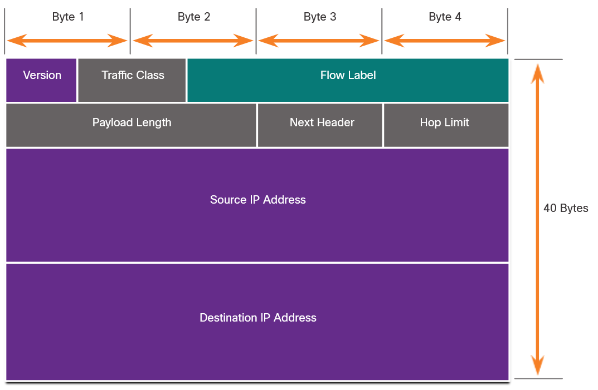

Подобно на писмото, съобщение, изпратено по компютърна мрежа, следва специфични правила за формат, за да бъде доставено и обработено.

**Frame** (кадър) действа като плик - осигурява адреса на предвиденото местоназначение и адреса на източника.

### Разлика: Network Encapsulation vs Ethernet Frame Encapsulation

**Network Encapsulation (общо):**
- Целият процес на добавяне на заглавки на всички нива (L7→L1)
- Включва: Application → Transport → Network → Data Link → Physical

**Ethernet Frame Encapsulation (специфично):**
- Само Layer 2 (Data Link) процесът
- Взема вече готов L3 пакет (IPv4/IPv6) и го "опакова" в Ethernet frame
- Работи само в локалната мрежа (NIC-to-NIC)

```
NETWORK ENCAPSULATION (пълен процес):
┌─────────────────────────────────────────┐
│ HTTP Data                                │ ← L7 (Application)
└─────────────────────────────────────────┘
           ↓ добавя се TCP header
┌────────┬─────────────────────────────────┐
│  TCP   │ HTTP Data                        │ ← L4 (Transport)
└────────┴─────────────────────────────────┘
           ↓ добавя се IP header
┌────────┬────────┬─────────────────────────┐
│   IP   │  TCP   │ HTTP Data               │ ← L3 (Network)
└────────┴────────┴─────────────────────────┘
           ↓ добавя се Ethernet header & trailer
┌────────┬────────┬────────┬─────────┬──────┐
│Eth Hdr │   IP   │  TCP   │HTTP Data│ FCS  │ ← L2 (Data Link)
└────────┴────────┴────────┴─────────┴──────┘
           ↓ конвертира се в битове
    01010101010101010101010101010...         ← L1 (Physical)
```

---

## 2.2 Ethernet и OSI модела

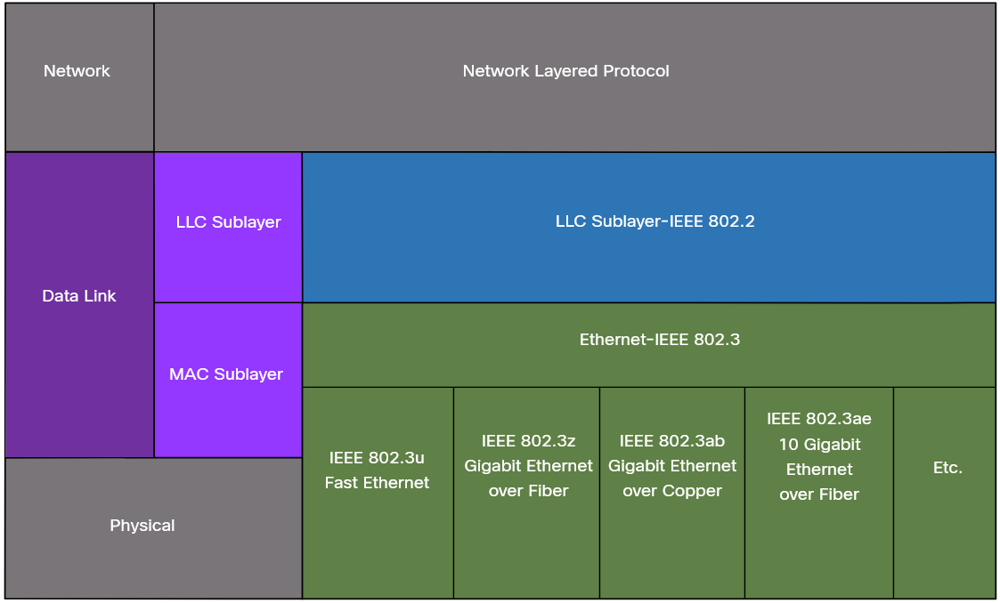

**Ethernet** е семейство мрежови технологии, дефинирани в стандартите **IEEE 802.2** и **802.3**.

Ethernet работи на **Data Link слоя** и **Physical слоя**.

### Поддържани скорости:
- 10 Mbps
- 100 Mbps
- 1000 Mbps (1 Gbps)
- 10,000 Mbps (10 Gbps)
- 40,000 Mbps (40 Gbps)
- 100,000 Mbps (100 Gbps)

---

## 2.3 Подслоеве на Data Link слоя

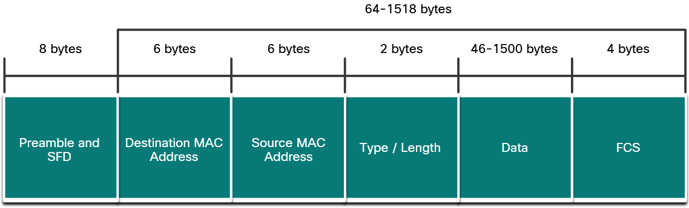

IEEE 802 LAN/MAN протоколите, включително Ethernet, използват **два отделни подслоя** на Data Link слоя:

### **LLC (Logical Link Control) - IEEE 802.2**
- Комуникира между мрежовия софтуер на горните слоеве и хардуера на долните
- Поставя информация в frame, която идентифицира използвания протокол на мрежовия слой
- Позволява на множество Layer 3 протоколи (IPv4, IPv6) да използват един и същ мрежов интерфейс

### **MAC (Media Access Control) - IEEE 802.3**
- Имплементиран в хардуер
- Отговорен за капсулирането на данни и контрола на достъпа до средата
- Осигурява Data Link адресиране
- Интегриран с различни физически слоеве

---

## 2.4 MAC подслоя - отговорности

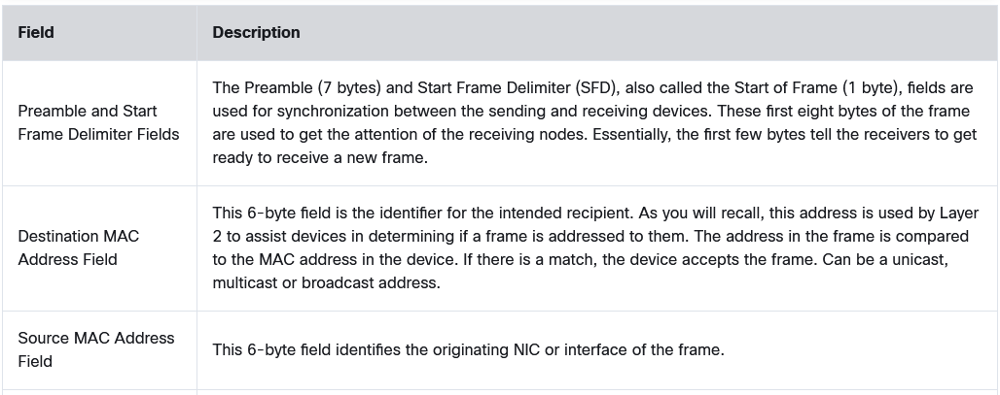

MAC подслоят е отговорен за:

### 1. Капсулиране на данни (Data Encapsulation)

**IEEE 802.3 капсулирането включва:**
- **Ethernet frame** - вътрешната структура
- **Ethernet адресиране** - source и destination MAC адреси
- **Откриване на грешки** - Frame Check Sequence (FCS)

### 2. Достъп до средата (Media Access Control)

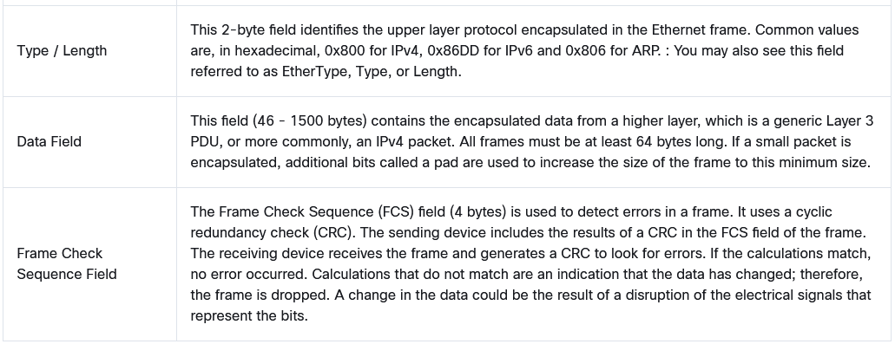

MAC подслоят включва спецификации за различни Ethernet комуникационни стандарти през различни типове среди - медни и оптични кабели.

### Забележка за CSMA/CD

**Стари Ethernet мрежи** (bus топология или хъбове):
- Споделена среда, half-duplex
- Използва CSMA/CD (Carrier Sense Multiple Access/Collision Detection)
- Гарантира, че само едно устройство предава едновременно

**Съвременни Ethernet мрежи**:
- Използват комутатори (switches)
- Работят в full-duplex режим
- **НЕ изискват CSMA/CD**

---

# Част III: Структура на Ethernet Frame

## 3.1 Полетата на Ethernet Frame

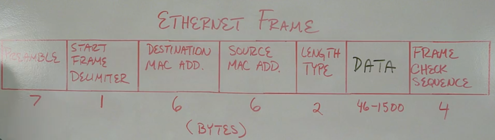

### Размери на Frame

**Минимален размер:** 64 bytes  
**Максимален размер:** 1518 bytes  
*(от Destination MAC до FCS полето)*

- **Runt frame** (collision fragment) - под 64 bytes → автоматично отхвърлен
- **Jumbo frame** (baby giant) - над 1500 bytes данни → поддържан от повечето Fast/Gigabit Ethernet

### Подробно описание на полетата

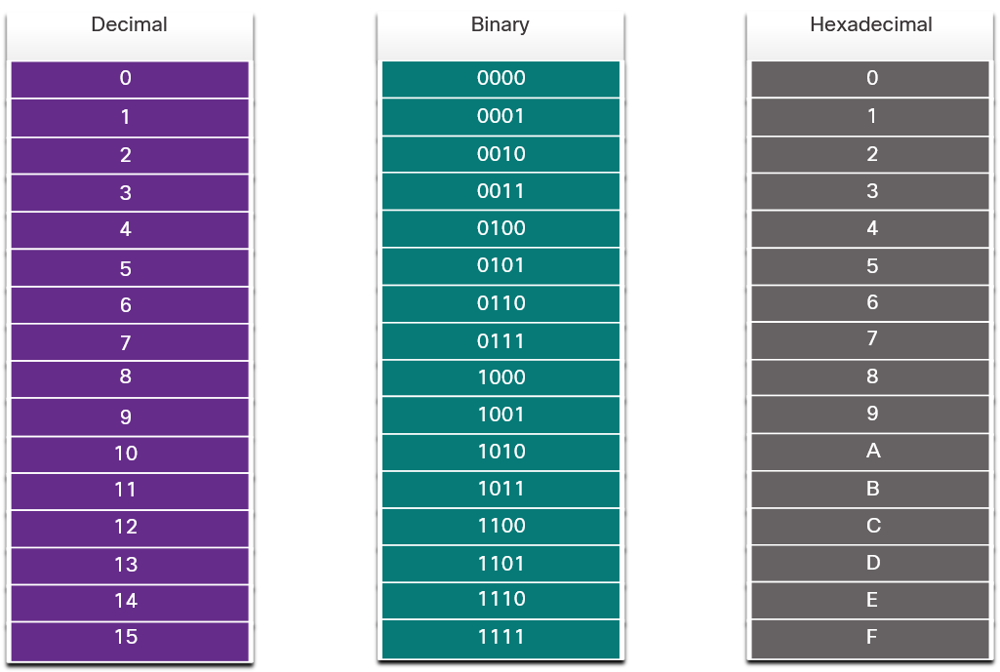

| Поле | Размер | Описание |
|------|---------|----------|
| **Preamble** | 7 bytes | Синхронизира приемащата NIC карта с битовете |
| **Start Frame Delimiter (SFD)** | 1 byte | Указва началото на действителната информация |
| **Destination MAC Address** | 6 bytes | MAC адресът на получателя |
| **Source MAC Address** | 6 bytes | MAC адресът на изпращача |
| **Length/Type** | 2 bytes | Дължина на данните ИЛИ тип на протокола (IPv4/IPv6) |
| **Data** | 46-1500 bytes | Капсулираните данни (IPv4/IPv6 пакет + TCP/UDP + данни) |
| **Frame Check Sequence (FCS)** | 4 bytes | Проверка за грешки (CRC) |

### Ключови моменти:

1. **Preamble + SFD** - синхронизация на битовете
2. **Destination MAC** - къде отива frame-ът в локалната мрежа
3. **Source MAC** - от къде идва frame-ът
4. **Length/Type** - може да бъде:
   - Дължина на данните
   - Тип протокол (0x0800 = IPv4, 0x86DD = IPv6)
5. **Data** - самата полезна информация
6. **FCS** - проверка за грешки при предаването

> **Забележка:** Ethernet не се интересува какъв вид данни предава - просто доставя frame от NIC до NIC.

---

# Част IV: MAC адреси

## 4.1 Шестнадесетична бройна система

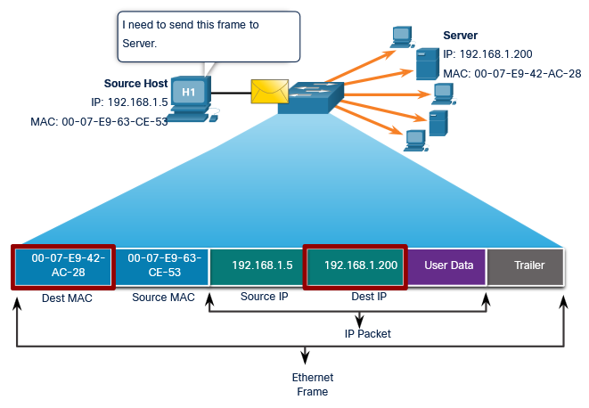

**MAC адресът** се състои от **48 бита** (6 bytes) и се представя в **шестнадесетична** (hexadecimal) бройна система.

### Защо шестнадесетична система?

Един шестнадесетичен знак представя **4 бита**, следователно:
- 48 бита = 12 шестнадесетични знака
- Пример: `00-1A-2B-3C-4D-5E`

### Таблица за преобразуване

| Двоична | Десетична | Шестнадесетична |
|---------|-----------|-----------------|
| 0000 | 0 | 0 |
| 0001 | 1 | 1 |
| 0010 | 2 | 2 |
| 0011 | 3 | 3 |
| 0100 | 4 | 4 |
| 0101 | 5 | 5 |
| 0110 | 6 | 6 |
| 0111 | 7 | 7 |
| 1000 | 8 | 8 |
| 1001 | 9 | 9 |
| 1010 | 10 | A |
| 1011 | 11 | B |
| 1100 | 12 | C |
| 1101 | 13 | D |
| 1110 | 14 | E |
| 1111 | 15 | F |

### Разширена таблица

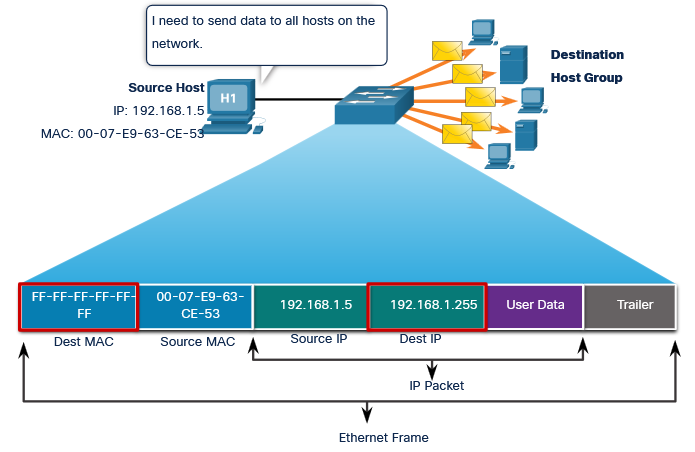

**Диапазон:** 
- Двоично: 00000000 до 11111111
- Шестнадесетично: 00 до FF
- Десетично: 0 до 255

### Нотация:
- `0x73` - с префикс 0x
- `73₁₆` - с индекс 16
- `73H` - със суфикс H

---

## 4.2 Типове MAC адреси

### 4.2.1 Unicast MAC адрес


**Unicast MAC адрес** е уникалният адрес, използван когато frame се изпраща от едно предаващо устройство към едно устройство-получател.

#### Пример:
```
Source: 192.168.1.5 (MAC: AA-AA-AA-AA-AA-AA)
    ↓
Destination: 192.168.1.200 (MAC: DD-DD-DD-DD-DD-DD)

Ethernet Frame:
┌──────────┬──────────┬──────┐
│ Dest MAC │ Src MAC  │ Data │
│  DD-DD   │  AA-AA   │ ...  │
└──────────┴──────────┴──────┘
```

**Важно:**
- За изпращане на unicast пакет са необходими destination IP адрес и destination MAC адрес
- Source MAC адресът **винаги трябва да бъде unicast**
- **ARP** (Address Resolution Protocol) се използва за намиране на MAC адрес от IPv4 адрес
- **ND** (Neighbor Discovery) се използва за намиране на MAC адрес от IPv6 адрес

---

### 4.2.2 Broadcast MAC адрес

**Broadcast MAC адрес:** `FF-FF-FF-FF-FF-FF` (48 единици)

Ethernet broadcast frame се **получава и обработва от всяко устройство** в Ethernet LAN.

#### Характеристики:
- Изпраща се от всички портове на комутатора (освен входящия)
- **НЕ се препраща от рутер**
- Използва се за:
  - DHCP заявки
  - ARP заявки
  - Broadcast съобщения

#### Пример:
```
Source: 192.168.1.5
    ↓ (изпраща към всички)
Broadcast: 192.168.1.255

Ethernet Frame:
┌──────────┬──────────┬──────┐
│ Dest MAC │ Src MAC  │ Data │
│  FF-FF   │  AA-AA   │ ...  │
└──────────┴──────────┴──────┘

Получават го: ВСИЧКИ устройства в LAN
```

---

### 4.2.3 Multicast MAC адрес

**Multicast MAC адрес** се получава и обработва от **група устройства**, принадлежащи към една multicast група.

#### Характеристики:

**За IPv4 multicast:**
- Destination MAC: `01-00-5E-xx-xx-xx`
- IP диапазон: 224.0.0.0 до 239.255.255.255

**За IPv6 multicast:**
- Destination MAC: `33-33-xx-xx-xx-xx`
- IP диапазон: ff00::/8

**За други протоколи:**
- Spanning Tree Protocol (STP)
- Link Layer Discovery Protocol (LLDP)

#### Поведение:
- Изпраща се от всички портове на комутатора (освен входящия)
- Може да се филтрира с **multicast snooping**
- **НЕ се препраща от рутер** (освен ако не е конфигуриран за multicast routing)

#### Използване:
- Routing протоколи (OSPF, EIGRP)
- Видео стрийминг приложения
- Мрежови откриващи протоколи

---

## 4.3 Сравнителна таблица: Unicast vs Broadcast vs Multicast

| Характеристика | Unicast | Broadcast | Multicast |
|----------------|---------|-----------|-----------|
| **MAC адрес** | Уникален | FF-FF-FF-FF-FF-FF | 01-00-5E-xx-xx-xx (IPv4)<br>33-33-xx-xx-xx-xx (IPv6) |
| **Получатели** | 1 устройство | Всички в LAN | Група устройства |
| **Switch поведение** | Към конкретен порт | Към всички портове | Към всички портове (или filtering) |
| **Router поведение** | Препраща | НЕ препраща | НЕ препраща (без multicast routing) |
| **Примери** | Нормална комуникация | ARP, DHCP | OSPF, видео стрийминг |

---

# Част V: Ethernet комутация

## 5.1 Как работят Ethernet комутаторите

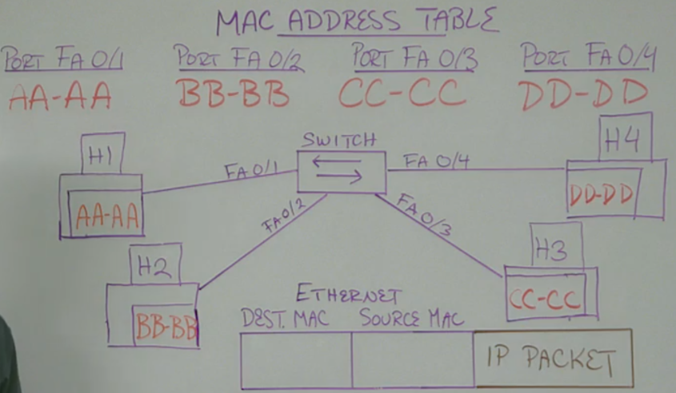

Ethernet комутаторите работят на **Layer 2 (Data Link)** от OSI модела.

Те вземат решения за препращане на базата на **Layer 2 информация** - полетата в Ethernet header-а.

### Ключови концепции:

1. **MAC Address Table** (таблица на MAC адреси)
   - Съхранява информация: MAC адрес → Порт
   - Изгражда се динамично

2. **Forwarding Decision** (решение за препращане)
   - Проверява Destination MAC адрес
   - Търси в MAC Address Table
   - Изпраща само към съответния порт

### Пример на комутация:

```
Топология:
H1 (MAC: AA-AA) ──[FA 0/1]──┐
                              │
H2 (MAC: BB-BB) ──[FA 0/2]── Switch
                              │
H3 (MAC: CC-CC) ──[FA 0/3]──┤
                              │
H4 (MAC: DD-DD) ──[FA 0/4]──┘

MAC Address Table:
┌──────────┬──────────┐
│ MAC Addr │   Port   │
├──────────┼──────────┤
│  AA-AA   │  FA 0/1  │
│  BB-BB   │  FA 0/2  │
│  CC-CC   │  FA 0/3  │
│  DD-DD   │  FA 0/4  │
└──────────┴──────────┘
```

**Когато H1 изпраща към H4:**
1. Switch получава frame на порт FA 0/1
2. Проверява Destination MAC: DD-DD
3. Търси в таблицата: DD-DD → FA 0/4
4. Изпраща frame **само** към FA 0/4

---

## 5.2 Изграждане на MAC Address Table

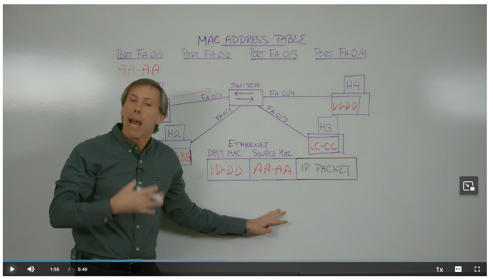

### Процес на обучение (Learning):

#### Стъпка 1: Първо изпращане (H1 → H4)

```
H1 изпраща frame към H4
Source MAC: AA-AA
Destination MAC: DD-DD

Switch:
1. Получава frame на FA 0/1
2. Проверява Source MAC: AA-AA
3. Добавя в таблицата: AA-AA → FA 0/1

MAC Address Table:
┌──────────┬──────────┐
│ MAC Addr │   Port   │
├──────────┼──────────┤
│  AA-AA   │  FA 0/1  │ ← НОВА!
└──────────┴──────────┘

4. Проверява Destination MAC: DD-DD
5. НЕ го намира в таблицата!
6. UNKNOWN UNICAST → изпраща към ВСИЧКИ портове (освен FA 0/1)
```

#### Важно: Unknown Unicast

Когато комутаторът **НЕ знае** къде е Destination MAC адресът:
- Действа като стар Ethernet hub
- Изпраща frame към **всички портове** (освен входящия)
- Това се нарича **flooding**

#### Реакция на устройствата:

```
H2: Сравнява своя MAC (BB-BB) с Dest MAC (DD-DD) → НЕ съвпада → ИГНОРИРА
H3: Сравнява своя MAC (CC-CC) с Dest MAC (DD-DD) → НЕ съвпада → ИГНОРИРА
H4: Сравнява своя MAC (DD-DD) с Dest MAC (DD-DD) → СЪВПАДА! → ПОЛУЧАВА
```

---

#### Стъпка 2: Отговор (H4 → H1)

```
H4 изпраща отговор към H1
Source MAC: DD-DD
Destination MAC: AA-AA

Switch:
1. Получава frame на FA 0/4
2. Проверява Source MAC: DD-DD
3. Добавя в таблицата: DD-DD → FA 0/4

MAC Address Table:
┌──────────┬──────────┐
│ MAC Addr │   Port   │
├──────────┼──────────┤
│  AA-AA   │  FA 0/1  │
│  DD-DD   │  FA 0/4  │ ← НОВА!
└──────────┴──────────┘

4. Проверява Destination MAC: AA-AA
5. НАМИРА го в таблицата: AA-AA → FA 0/1
6. Изпраща frame САМО към FA 0/1 (filtering!)
```

---

#### Стъпка 3: Повторно изпращане (H1 → H4)

```
H1изпраща отново към H4
Source MAC: AA-AA
Destination MAC: DD-DD

Switch:
1. Получава frame на FA 0/1
2. Проверява Source MAC: AA-AA
3. Вече е в таблицата → обновява timestamp

MAC Address Table:
┌──────────┬──────────┬────────────┐
│ MAC Addr │   Port   │ Last Seen  │
├──────────┼──────────┼────────────┤
│  AA-AA   │  FA 0/1  │ току-що ✓  │
│  DD-DD   │  FA 0/4  │ преди 5s   │
└──────────┴──────────┴────────────┘

4. Проверява Destination MAC: DD-DD
5. НАМИРА го в таблицата: DD-DD → FA 0/4
6. Изпраща frame САМО към FA 0/4 (FILTERING!)

Резултат: Само H4 получава frame-а!
```

### Aging на записите

MAC адресите се запазват в таблицата за **около 5 минути** (aging time).

Ако устройство не изпраща трафик за 5 минути:
- Записът се изтрива от таблицата
- При следващо получаване на frame към това устройство → unknown unicast → flooding

---

## 5.3 Обобщение на процеса на комутация

### Алгоритъм на комутатора:

```
ПРИ ПОЛУЧАВАНЕ НА FRAME:

1. LEARNING (Обучение):
   - Проверка на Source MAC адрес
   - Ако НЕ е в таблицата → ДОБАВИ
   - Ако Е в таблицата → ОБНОВИ timestamp

2. FORWARDING (Препращане):
   - Проверка на Destination MAC адрес
   - Ако Е в таблицата:
       → Изпрати към съответния порт (FILTERING)
   - Ако НЕ е в таблицата:
       → Изпрати към ВСИЧКИ портове (FLOODING)
   - Ако е BROADCAST (FF-FF-FF-FF-FF-FF):
       → Изпрати към ВСИЧКИ портове

3. AGING (Стареене):
   - Записи без активност за 5 min → ИЗТРИВАНЕ
```

### Предимства на комутаторите:

✅ **Micro-segmentation** - всеки порт е отделен collision domain  
✅ **Full-duplex** - двупосочна комуникация едновременно  
✅ **Dedicated bandwidth** - всеки порт има пълна скорост  
✅ **Filtering** - изпраща само към нужните портове  
✅ **Security** - изолация между портове  

---

# Част VI: Практически упражнения

## 6.1 Lab: Преглед на трафик в Wireshark

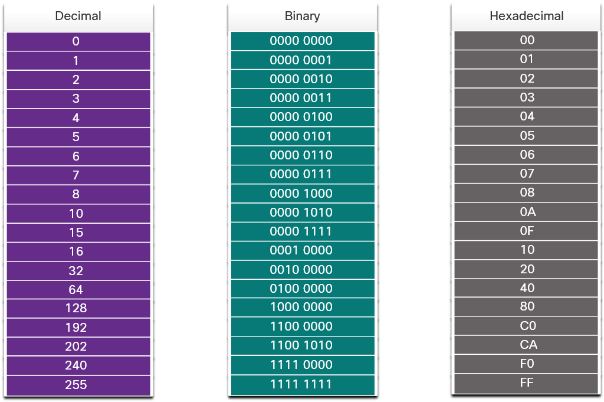

### Цели:
1. Изтегляне и инсталиране на Wireshark
2. Заснемане и анализ на ARP данни
3. Преглед на ARP кеша на компютъра

### Файл на лабораторията:
`6-04. View_Captured_Traffic_in_Wireshark.htm`

---

## 6.2 Lab: Използване на Wireshark за изследване на Ethernet Frames

### Цели:
1. **Част 1:** Изследване на полетата в Ethernet II Frame
2. **Част 2:** Използване на Wireshark за заснемане и анализ на Ethernet frames

### Какво ще научите:
- Идентифициране на Preamble, SFD, MAC адреси
- Анализ на Length/Type полето
- Проверка на FCS (Frame Check Sequence)
- Изследване на капсулирани протоколи (IPv4, TCP, HTTP)

### Файл на лабораторията:
`6-05. Use_Wireshark_to_Examine_Ethernet_Frames.htm`

---

# Обобщение на ключовите понятия

## Основни термини:

| Термин | Определение |
|--------|-------------|
| **Ethernet** | Де факто стандарт за локални мрежи (LAN) |
| **IEEE 802.3** | Комитет, отговорен за Ethernet стандартите |
| **Frame** | Единица данни на Data Link слоя (Layer 2) |
| **MAC Address** | 48-битов физически адрес на мрежовата карта |
| **Encapsulation** | Процес на добавяне на header и trailer към данни |
| **Switch** | Layer 2 устройство, което препраща frames на базата на MAC адреси |
| **MAC Address Table** | Таблица в комутатора: MAC адрес → Порт |
| **Flooding** | Изпращане на frame към всички портове (при unknown unicast) |
| **Filtering** | Изпращане на frame само към нужния порт |

---

## Типове MAC адреси:

```
┌─────────────────────────────────────────────────┐
│                 MAC ADDRESS TYPE                 │
├─────────────┬───────────────┬───────────────────┤
│   UNICAST   │   BROADCAST   │    MULTICAST      │
├─────────────┼───────────────┼───────────────────┤
│ Уникален    │ FF-FF-FF-FF-  │ 01-00-5E (IPv4)   │
│ адрес       │    FF-FF      │ 33-33 (IPv6)      │
├─────────────┼───────────────┼───────────────────┤
│ 1 получател │ Всички        │ Група устройства  │
├─────────────┼───────────────┼───────────────────┤
│ Към 1 порт  │ Към всички    │ Към всички портове│
│             │   портове     │ (или snooping)    │
└─────────────┴───────────────┴───────────────────┘
```

---

## Структура на Ethernet Frame:

```
┌──────────┬─────┬──────────┬──────────┬────────┬──────┬─────┐
│ Preamble │ SFD │ Dest MAC │ Src MAC  │ Length │ Data │ FCS │
│  7 bytes │ 1 B │  6 bytes │ 6 bytes  │ 2 B    │46-1500B│ 4 B│
└──────────┴─────┴──────────┴──────────┴────────┴──────┴─────┘
            ↑                                            ↑
            └─── Минимум 64 bytes (от Dest MAC до FCS) ─┘
            └─── Максимум 1518 bytes ───────────────────┘
```

---

## Процес на комутация - визуална диаграма:

```
RECEIVE FRAME
     │
     ├─→ [1] LEARNING
     │      │
     │      ├─→ Проверка Source MAC
     │      ├─→ В таблицата?
     │      │    ├─→ ДА: Обнови timestamp
     │      │    └─→ НЕ: Добави нов запис
     │
     └─→ [2] FORWARDING
            │
            ├─→ Проверка Destination MAC
            │
            ├─→ Broadcast (FF-FF)?
            │    └─→ ДА: Изпрати към ВСИЧКИ портове
            │
            ├─→ В таблицата?
            │    ├─→ ДА: Изпрати към КОНКРЕТЕН порт (FILTERING)
            │    └─→ НЕ: Изпрати към ВСИЧКИ портове (FLOODING)
            │
            └─→ DONE
```

---

## Съпоставка: Hub vs Switch

| Характеристика | Hub | Switch |
|----------------|-----|--------|
| **OSI Layer** | Layer 1 (Physical) | Layer 2 (Data Link) |
| **Решение** | Няма интелигентност | На базата на MAC адрес |
| **Трафик** | Към всички портове | Само към нужен порт |
| **Collision Domain** | Един за всички портове | Един за всеки порт |
| **Bandwidth** | Споделена | Dedicated за всеки порт |
| **Duplex** | Half-duplex | Full-duplex |
| **Ефективност** | Ниска | Висока |

---

# Често задавани въпроси

## В1: Защо MAC адресите са 48 бита?

**Отговор:** 48 бита осигуряват 2^48 = 281,474,976,710,656 уникални адреси. Първите 24 бита (OUI - Organizationally Unique Identifier) се разпределят на производители, останалите 24 бита се управляват от производителя.

## В2: Може ли да се промени MAC адресът?

**Отговор:** Физически MAC адресът е вграден в NIC картата (burned-in address), но повечето операционни системи позволяват софтуерно променяне (MAC spoofing) за тестване или сигурност.

## В3: Какво се случва когато MAC Address Table е пълна?

**Отговор:** При достигане на капацитета комутаторът:
- Спира да добавя нови записи
- Използва flooding за нови адреси
- Може да изтрие най-стари записи (зависи от модела)

## В4: Защо се използва FCS (Frame Check Sequence)?

**Отговор:** FCS използва CRC (Cyclic Redundancy Check) за откриване на грешки при предаване. Ако CRC не съвпада при получаване, frame-ът се отхвърля.

## В5: Каква е разликата между MAC адрес и IP адрес?

| MAC Address | IP Address |
|-------------|------------|
| Layer 2 (Data Link) | Layer 3 (Network) |
| Физически, постоянен | Логически, променлив |
| Локален (в LAN) | Глобален (между мрежи) |
| 48 бита (hex) | 32 бита IPv4 / 128 бита IPv6 |
| NIC-to-NIC | End-to-End |

---

# Допълнителни ресурси

## За допълнително четене:
- [IEEE 802.3 Ethernet Working Group](https://www.ieee802.org/3/)
- [RFC 894 - A Standard for the Transmission of IP Datagrams over Ethernet Networks](https://tools.ietf.org/html/rfc894)
- Cisco Networking Academy - CCNA Course

## Инструменти за практика:
- **Packet Tracer** - симулатор за мрежи
- **Wireshark** - анализатор на мрежов трафик
- **GNS3** - мрежов емулатор

---

# Проверка на знанията

## Тест за самооценка:

1. **Колко байта е минималният размер на Ethernet frame?**
   - A) 46 bytes
   - B) 64 bytes ✓
   - C) 1518 bytes
   - D) 1500 bytes

2. **Кой MAC адрес е broadcast?**
   - A) 00-00-00-00-00-00
   - B) 01-00-5E-00-00-00
   - C) FF-FF-FF-FF-FF-FF ✓
   - D) AA-AA-AA-AA-AA-AA

3. **Какво прави комутаторът при unknown unicast?**
   - A) Отхвърля frame-а
   - B) Изпраща към default gateway
   - C) Flooding към всички портове ✓
   - D) Записва в log file

4. **На кой слой от OSI модела работи Ethernet switch?**
   - A) Layer 1
   - B) Layer 2 ✓
   - C) Layer 3
   - D) Layer 4

5. **Колко време се пазят MAC адресите в таблицата по подразбиране?**
   - A) 1 минута
   - B) 5 минути ✓
   - C) 10 минути
   - D) Безкрайно

---

## Задачи за упражнение:

### Задача 1: MAC адреси
Преобразувайте следните MAC адреси от двоична в шестнадесетична система:
```
a) 00001010-00001010-00001010-00001010-00001010-00001010
b) 11111111-11111111-11111111-11111111-11111111-11111111
c) 00000001-00000000-01011110-00000000-00000000-00000001
```

### Задача 2: Frame анализ
Дадена е следната топология:
```
PC1 (MAC: 11-11) ──[Fa0/1]──┐
PC2 (MAC: 22-22) ──[Fa0/2]── Switch (празна MAC таблица)
PC3 (MAC: 33-33) ──[Fa0/3]──┤
PC4 (MAC: 44-44) ──[Fa0/4]──┘
```

PC1 изпраща frame към PC3. Опишете стъпка по стъпка:
1. Какво прави комутаторът?
2. Кои устройства получават frame-а?
3. Каква ще бъде MAC таблицата след това?

### Задача 3: Идентифициране на тип адрес
Определете типа на следните MAC адреси:
```
a) 00-1A-2B-3C-4D-5E  → ?
b) FF-FF-FF-FF-FF-FF  → ?
c) 01-00-5E-01-01-01  → ?
d) 33-33-00-00-00-01  → ?
```

---

**Край на лекцията**

За въпроси и консултации:  
📧 svetoslav.atanasov@trakia-uni.bg  
🏛️ Тракийски университет - Стара Загора  
🌐 www.trakia-uni.bg

---

*Версия: 2.0 - Подобрена структура*  
*Последна актуализация: Декември 2024*
